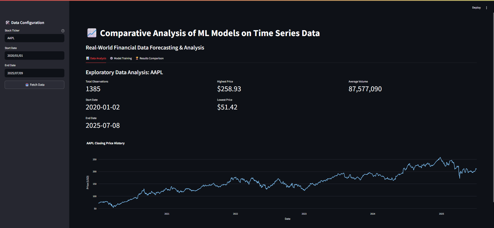

# Comparative Analysis and Deployment of Machine Learning Models on Real-World Time Series Data

## 📌 Project Overview
This project focuses on the comparative analysis of different Machine Learning and Statistical models for time series forecasting. We utilize real-world financial data (stock prices) fetched dynamically using the Yahoo Finance API. The project is deployed as an interactive web application using **Streamlit**, allowing users to experiment with different datasets and models in real-time.

## 🚀 Features
- **Real-World Data**: Fetch live stock market data for any ticker (e.g., AAPL, GOOGL, TSLA).
- **Data Visualization**: Interactive charts for raw data and train/test splits.
- **Multi-Model Analysis**:
  - **ARIMA**: Classical statistical approach for linear trends.
  - **XGBoost**: Gradient boosting for non-linear patterns.
  - **Random Forest**: Ensemble learning method.
  - **SVR**: Support Vector Regression for high-dimensional spaces.
  - **Prophet**: Robust forecasting for seasonal data (Facebook).
- **Advanced Features**:
  - Rolling window statistics (Mean, Std).
  - Data Scaling (MinMax).
  - Interactive Plotly visualizations.
- **Performance Metrics**: RMSE, MAE, and MAPE.
- **Interactive Deployment**: User-friendly interface built with Streamlit.

## � Screenshots
*(Add your screenshots here)*


## �📂 Project Structure
```
Project2/
├── app.py                 # Main Streamlit application
├── requirements.txt       # Python dependencies
├── README.md              # Project documentation
├── docs/                  # Project reports and documentation
├── data/                  # Directory for storing downloaded datasets
├── models/                # Directory for saving trained models
└── src/                   # Source code modules
    ├── data_loader.py     # Data fetching and loading logic
    ├── features.py        # Feature engineering (lags, dates)
    └── model_trainer.py   # Model training and evaluation classes
```

## 🛠️ Installation & Setup

1. **Prerequisites**: Ensure you have Python installed (3.8+ recommended).

2. **Install Dependencies**:
   ```bash
   pip install -r requirements.txt
   ```

3. **Run the Streamlit App**:
   ```bash
   streamlit run app.py
   ```

4. **Run the FastAPI Server**:
   ```bash
   python api.py
   ```
   Access the API documentation at `http://localhost:8000/docs`.

## 📊 Methodology

### 1. Data Collection
We use the `yfinance` library to download historical daily stock prices. The 'Close' price is used as the target variable.

### 2. Feature Engineering
For Machine Learning models like XGBoost, we transform the time series problem into a supervised learning problem by creating:
- **Lag Features**: Values from previous time steps (t-1, t-2, ..., t-30).
- **Temporal Features**: Day of week, month, quarter, year.

### 3. Models
- **ARIMA**: Captures linear relationships and temporal structures (trends, seasonality).
- **XGBoost**: Captures non-linear relationships and interactions between lag features.

### 4. Evaluation
We split the data into training and testing sets (chronological split) to avoid data leakage. Models are evaluated on the test set using RMSE and MAE.

## 📈 Results
The application provides a visual comparison of the actual vs. predicted values, along with a table of error metrics to help identify the best-performing model for the selected dataset.

## 🤝 Contributing
Feel free to fork this repository and submit pull requests to add more models (e.g., LSTM, Prophet) or features.


